# Relatório técnico — Tech Challenge IADT Fase 1

**Tema:** sistema inteligente de suporte ao diagnóstico e detecção de riscos em saúde da mulher  
**Recorte desta fase:** classificação de câncer de mama (maligno vs. benigno) com Machine Learning tabular  
**Dataset:** Breast Cancer Wisconsin Diagnostic (UCI), equivalente ao [conjunto sugerido no Kaggle](https://www.kaggle.com/datasets/uciml/breast-cancer-wisconsin-data/data)  
**Repositório Git:** https://github.com/ddomingues2014/FIAP_FASE1

---

## 1. Problema e objetivo

Uma rede de hospitais e centros especializados no atendimento à mulher precisa acelerar a triagem de risco. O enunciado da Fase 1 pede a **base de um sistema de IA** com foco em Machine Learning: analisar dados médicos automaticamente para identificar padrões relacionados à segurança e à saúde feminina.

Escolhemos o **diagnóstico de câncer de mama** a partir de 30 atributos numéricos extraídos de imagens digitais de núcleos celulares no exame FNA (*fine needle aspirate*). A tarefa é binária:

| Classe | Código usado no projeto | Significado clínico |
|---|---|---|
| Positiva | 1 | Maligno |
| Negativa | 0 | Benigno |

O sistema **não emite diagnóstico final**. Ele calcula uma probabilidade e uma explicação (SHAP) para apoiar o profissional. A palavra final é sempre do médico.

O enunciado também cita sinais de violência doméstica em prontuários. Esse recorte exigiria NLP sobre texto clínico e ficou **fora do escopo da Fase 1**, que prioriza classificação tabular bem documentada, métricas e explicabilidade.

---

## 2. Dados

### 2.1 Fonte

- Carregamento reprodutível: `sklearn.datasets.load_breast_cancer`
- Mesma origem UCI do CSV do Kaggle (colunas `id` / `Unnamed: 32` do Kaggle não entram, pois o sklearn já entrega só as 30 features clínicas)
- 569 amostras, 30 features contínuas, 0 valores ausentes na versão sklearn

As features descrevem estatísticas **mean**, **error** (desvio padrão) e **worst** (média dos três maiores valores) de dez medidas nucleares: raio, textura, perímetro, área, suavidade, compacidade, concavidade, pontos côncavos, simetria e dimensão fractal.

O rótulo original do sklearn é invertido em relação à intuição clínica (`0 = malignant`). Remapeamos para **1 = maligno**, de modo que recall/F1 da classe positiva correspondam ao risco que queremos detectar.

### 2.2 Visão geral

- Benignos: 357 (~62,7%)
- Malignos: 212 (~37,3%)
- Desbalanceamento moderado — accuracy sozinha mascara erros na classe rara/crítica

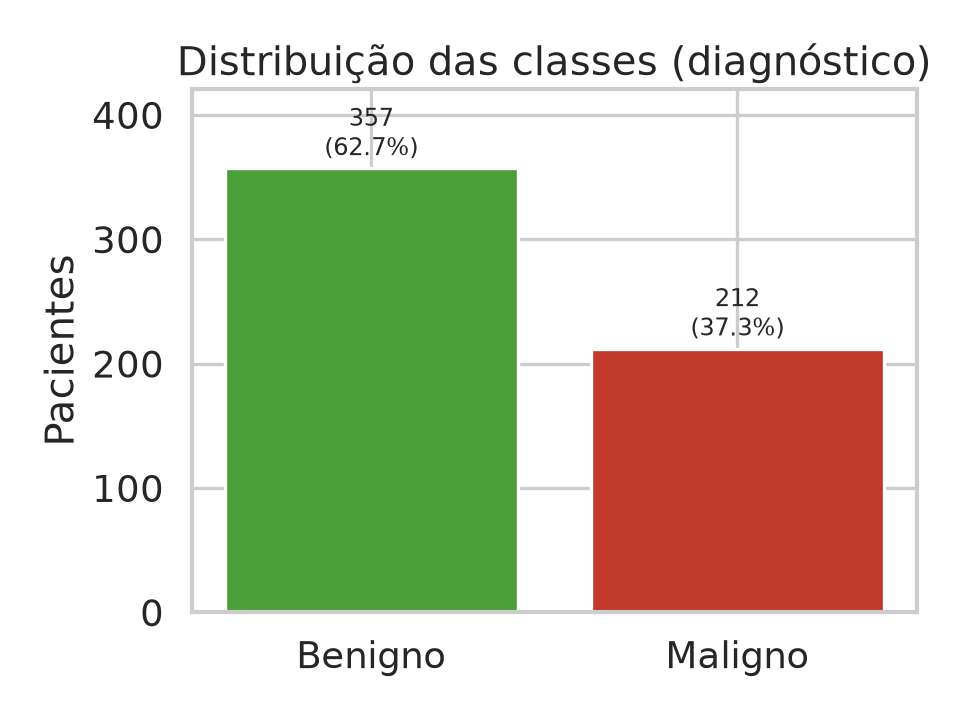

---

## 3. Exploração de dados (EDA)

### 3.1 Estatísticas descritivas e padrões clínicos

Tumores malignos tendem a apresentar **maior raio, perímetro, área e concavidade**. Isso é coerente com a literatura do FNA: núcleos maiores e mais irregulares associam-se a malignidade.

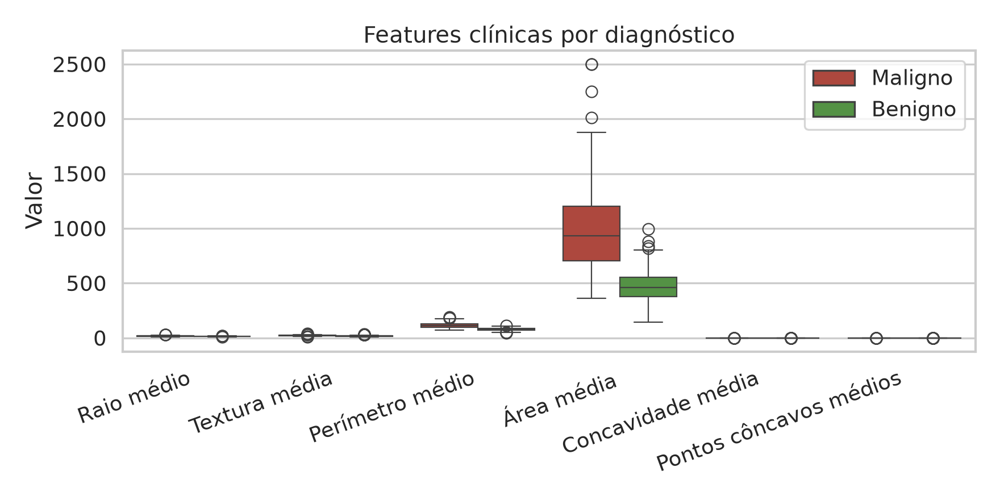

As distribuições condicionais mostram sobreposição (nem todo núcleo grande é maligno), mas a massa de probabilidade do grupo maligno desloca-se à direita em `mean_radius`, `mean_concave_points`, `worst_area` e `worst_concave_points`.

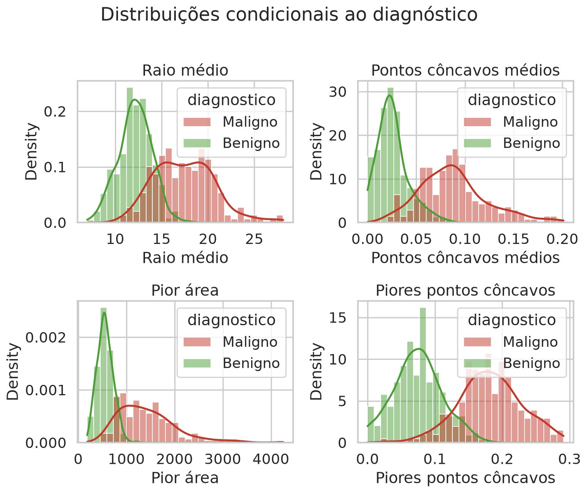

### 3.2 Correlação e colinearidade

Raio, perímetro e área são quase colineares (perímetro ≈ 2πr e área ≈ πr² em núcleos aproximadamente circulares). O mesmo vale para as versões *worst*.

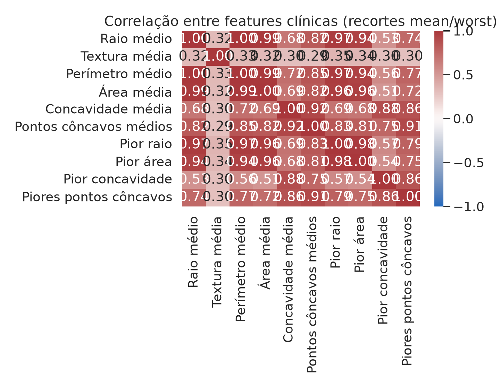

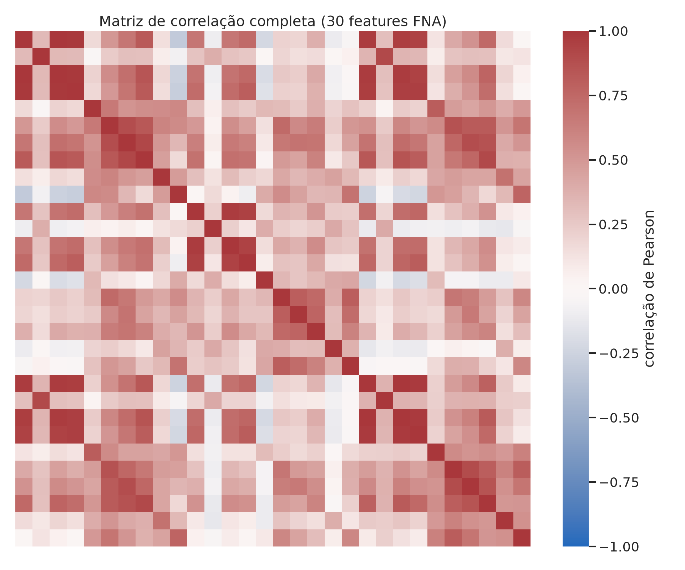

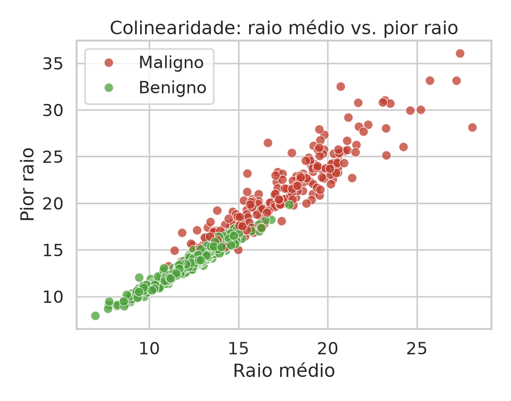

**Decisão:** manter as 30 features originais. O enunciado pede pipeline de pré-processamento e análise de correlação, não necessariamente redução dimensional. Regularização L2 na logística e o ensemble do Random Forest lidam com colinearidade de forma aceitável neste tamanho de amostra. PCA ficou como melhoria futura, não como etapa obrigatória.

---

## 4. Pré-processamento

Estratégia implementada em `src/preprocess.py`, sempre **dentro de um `sklearn.Pipeline`**, para não vazar estatísticas do teste:

1. **Limpeza:** na versão sklearn não há missing. Ainda assim usamos `SimpleImputer(strategy="median")` para documentar o tratamento exigido e para tolerar o CSV do Kaggle (que traz coluna vazia `Unnamed: 32`).
2. **Tipos:** todas as features já são numéricas contínuas; o alvo foi binarizado (maligno = 1).
3. **Escala:** `StandardScaler`. Obrigatório para KNN (distância euclidiana) e recomendado para regressão logística. Árvores não precisam de escala, mas o mesmo pré-processamento deixa a comparação justa.
4. **Split:** `train_test_split(test_size=0.20, stratify=y, random_state=42)` — 80/20 com a mesma proporção maligno/benigno nos dois conjuntos.

Não houve encoding categórico. Não removemos outliers agressivamente: valores extremos de área/raio são sinal clínico, não necessariamente erro de digitação.

---

## 5. Modelagem

Treinamos **três** classificadores com `GridSearchCV` (5 folds estratificados) otimizando **recall** da classe positiva:

| Modelo | Motivação | Hiperparâmetros buscados |
|---|---|---|
| **Regressão logística** | Baseline clínico, coeficientes interpretáveis, `class_weight="balanced"` | `C ∈ {0.1, 1, 10}` |
| **Random Forest** | Relações não lineares + importância nativa de features | `n_estimators`, `max_depth`, `min_samples_split` |
| **KNN** | Terceiro algoritmo simples e didático; muito sensível à escala | `n_neighbors`, `weights` |

O modelo de produção da demo é o de **maior recall maligno** no teste, com desempate em F1 e ROC-AUC (`src/train.py`).

---

## 6. Treinamento, métricas e interpretação

### 6.1 Por que essas métricas?

No câncer, **falso negativo** (maligno predito como benigno) atrasa biópsia e tratamento. Por isso:

1. **Recall maligno** — métrica principal (sensibilidade)
2. **F1 maligno** — equilíbrio com precisão (falsos positivos geram ansiedade e exames extras, mas o custo é menor que o FN)
3. **Matriz de confusão** — deixa FN/FP explícitos
4. **Accuracy** — reportada com crítica (classe majoritária benigna)
5. **ROC-AUC / PR-AUC** — qualidade do ranking das probabilidades

Resultados no conjunto de teste (split 80/20 estratificado, `random_state=42`):

| Modelo | Accuracy | Recall maligno | Precision maligno | F1 maligno | ROC-AUC |
|---|---:|---:|---:|---:|---:|
| Regressão logística | 0.974 | **0.952** | 0.976 | 0.964 | 0.995 |
| Random Forest | 0.974 | 0.929 | 1.000 | 0.963 | 0.998 |
| KNN | 0.939 | 0.857 | 0.973 | 0.911 | 0.983 |

A **regressão logística** foi escolhida para a demo: maior recall da classe maligna (métrica principal). O Random Forest empata em accuracy e tem ROC-AUC ligeiramente maior, mas deixa passar mais falsos negativos. O KNN fica atrás, como esperado em um espaço com colinearidade.

Hiperparâmetros via `GridSearchCV` (5 folds, scoring = recall): logística `C=1.0`; RF `n_estimators=250`, `max_depth=8`; KNN `k=3`, `weights=uniform`.

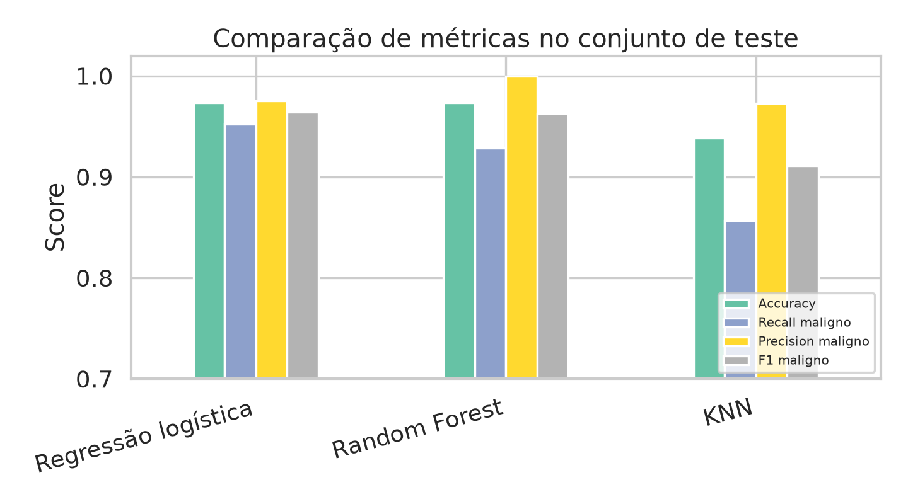

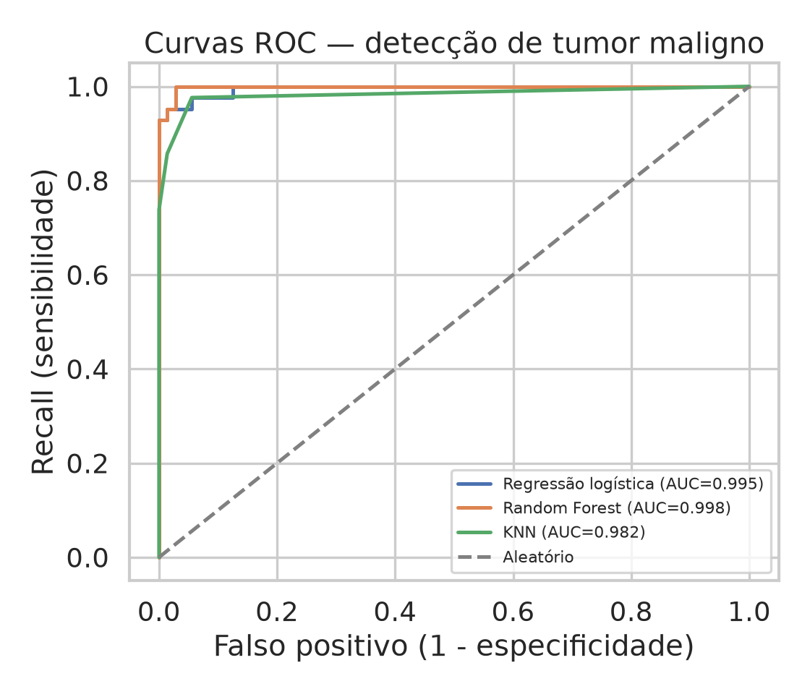

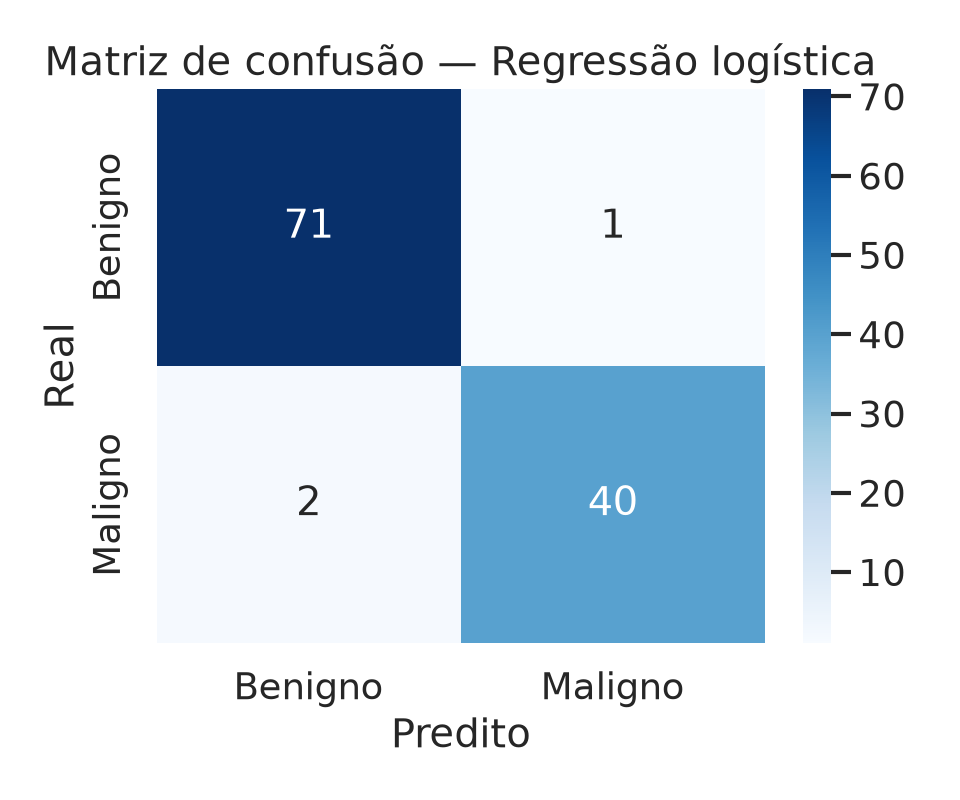

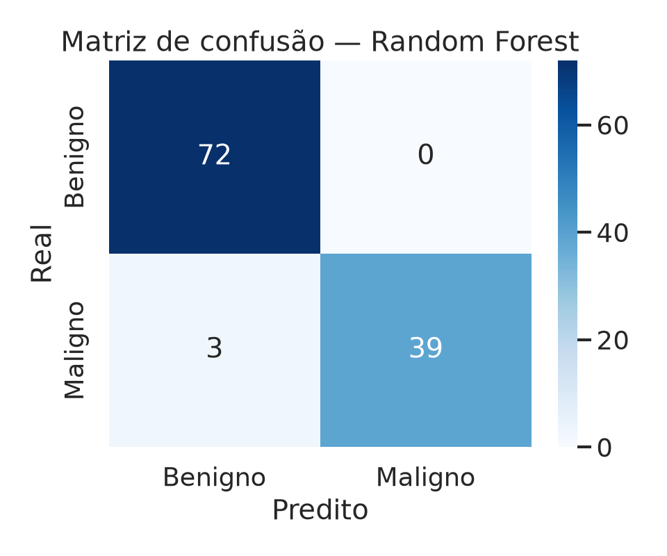

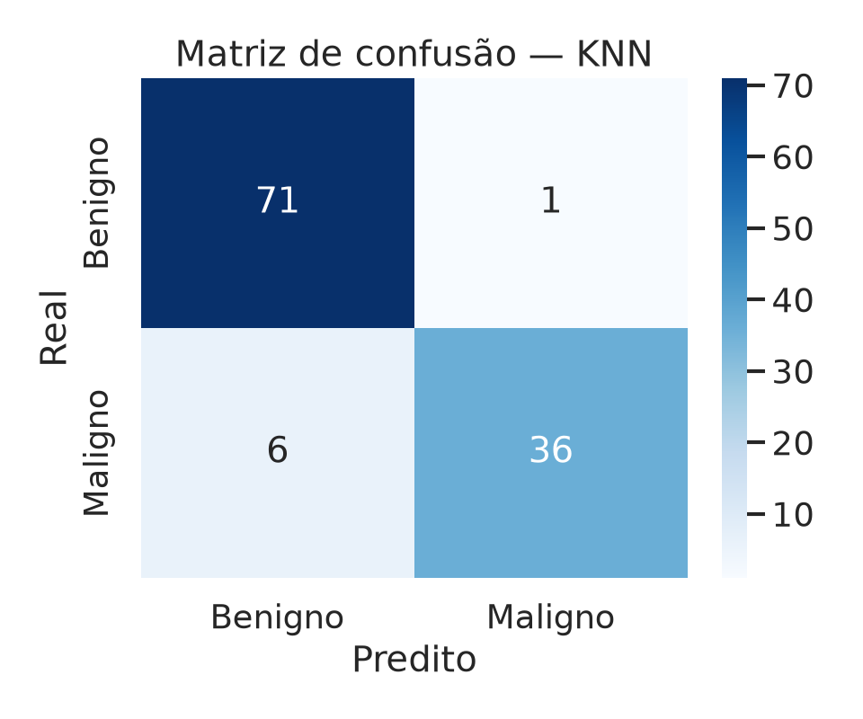

Os números exatos da última execução estão em `models/metrics.json` e `models/metrics_table.csv`. O app Streamlit e `python -m src.train` exibem a tabela atualizada.

### 6.2 Leitura crítica dos resultados

Espera-se accuracy e ROC-AUC altos neste dataset clássico — ele é relativamente linearmente separável. Isso **não** significa prontidão clínica:

- Uma única origem (Wisconsin), ~569 casos, sem validação temporal nem multicêntrica
- Features de laboratório já “limpas”, muito diferentes de um prontuário real
- Risco de superestimar generalização (mesmo com split estratificado e CV)

Um modelo utilizável na triagem deveria ser calibrado no hospital de destino, monitorado para *drift* e sempre revisado por um médico.

---

## 7. Explicabilidade

### 7.1 Feature importance

- **Random Forest:** impureza (Gini) — em geral destacam `worst_concave_points`, `worst_area`, `mean_concave_points`, `worst_radius`
- **Regressão logística:** valor absoluto dos coeficientes **após** o `StandardScaler` (comparáveis entre si)

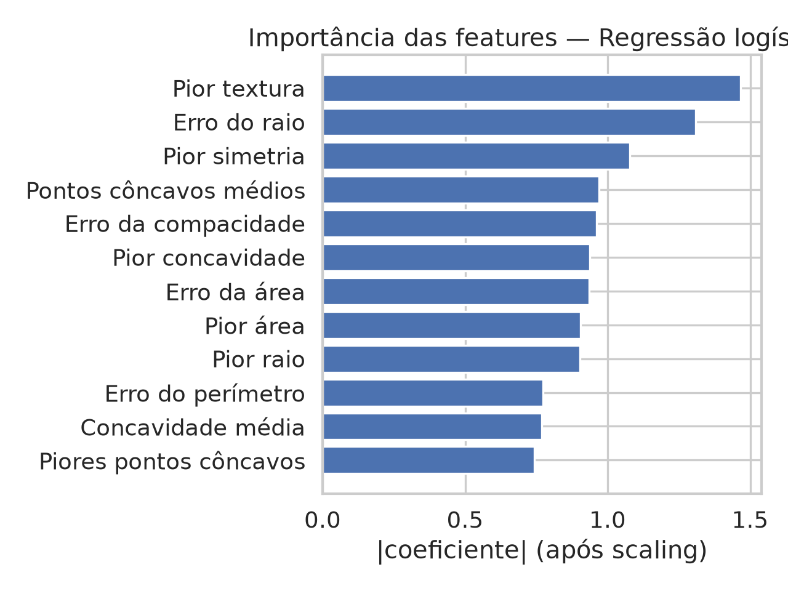

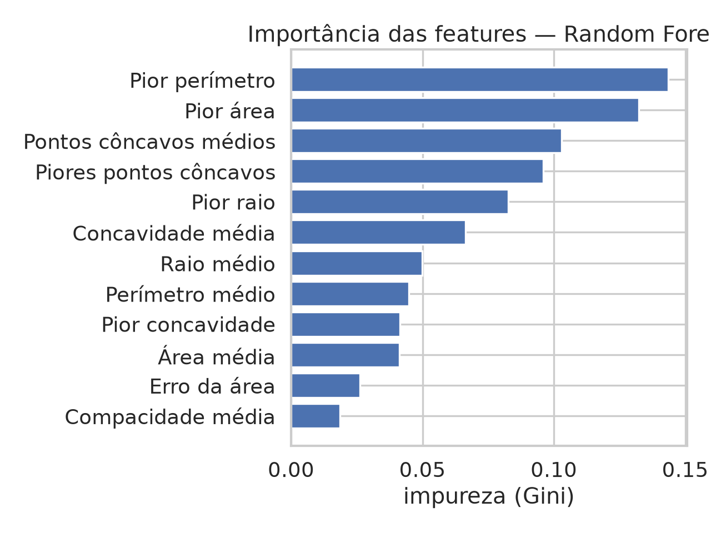

### 7.2 SHAP

Usamos SHAP no modelo interpretável selecionado (árvore ou logística; se o melhor for KNN, o SHAP recai no Random Forest).

- **Global (beeswarm):** quais features mais empurram a predição para maligno no conjunto de teste
- **Local (waterfall):** um caso maligno e um benigno, úteis na demo e no vídeo

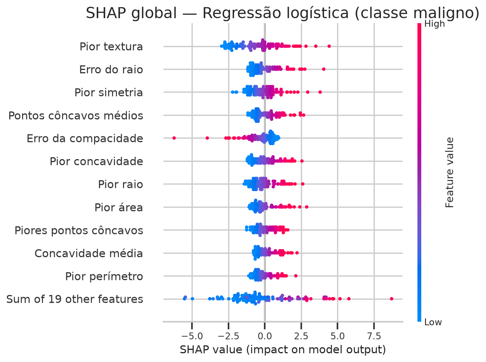

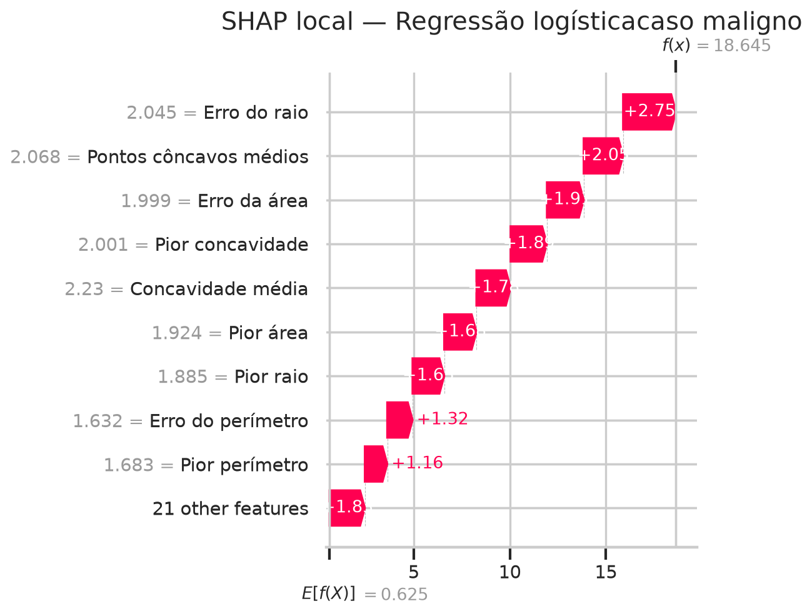

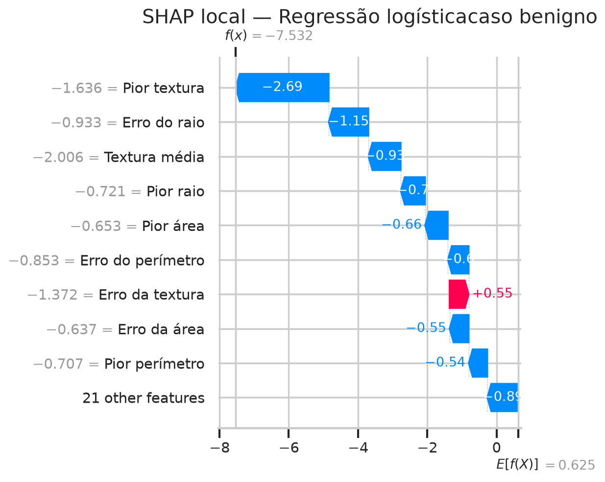

Nesta execução o melhor modelo (e o usado no SHAP) foi a **regressão logística**. Se uma nova rodada escolher o Random Forest, os arquivos terão o prefixo `shap_*_random_forest.png`.

Interpretação para o clínico: barras que aumentam o valor SHAP elevam a probabilidade de **maligno**. O waterfall parte do valor base (média do modelo) e soma as contribuições até a predição do caso.

---

## 8. Uso prático e ética

**Pode ser usado na prática?** Como **apoio à triagem / segunda opinião quantitativa**, em ambiente controlado, sim. Como diagnóstico automático, **não**.

Como usaria um hospital, em tese:

1. Laboratório informa as 30 medidas do FNA
2. O sistema devolve probabilidade de malignidade + SHAP local
3. O médico cruza com exame físico, imagem e biópsia
4. Casos de alta probabilidade sobem na fila de revisão

Salvaguardas:

- Disclaimer visível no app
- Médico no loop (human-in-the-loop)
- Sem dados pessoais no repositório (dataset público e anônimo)
- Sem pretensão de cobrir violência doméstica nesta fase
- CNN em mamografia (EXTRA do enunciado) ficou de fora, para concentrar a entrega no pipeline tabular

---

## 9. Organização do código

| Caminho | Papel |
|---|---|
| `src/data.py` | Carga Wisconsin + split estratificado |
| `src/preprocess.py` | Pipeline imputer + scaler |
| `src/eda.py` | Figuras de exploração |
| `src/train.py` | GridSearch, persistência, escolha do melhor modelo |
| `src/evaluate.py` | Métricas e gráficos de desempenho |
| `src/explain.py` | Feature importance + SHAP |
| `app/streamlit_app.py` | Demo (predição + análise) |
| `scripts/explore.py` | EDA + discussão no terminal (vídeo) |
| `scripts/export_figures.py` | Regenera todos os prints |
| `Dockerfile` | Ambiente reproduzível da demo |

Execução: ver `README.md`.

---

## 10. Vídeo de demonstração (roteiro ≤ 15 min)

Checklist para gravação (YouTube ou Vimeo, público ou não listado):

1. **(1–2 min)** Contexto do hospital + recorte Wisconsin + disclaimer
2. **(3 min)** `python scripts/explore.py`: EDA, balanceamento, boxplots, correlação
3. **(4 min)** Pipeline, os três modelos, métricas (ênfase em recall) e SHAP
4. **(4 min)** Streamlit ao vivo: caso maligno, caso benigno, waterfall
5. **(1 min)** Limitações e papel do médico; link do GitHub

---

## 11. Conclusão

A Fase 1 entrega um ciclo completo de ML aplicado à saúde da mulher: exploração, pré-processamento com `Pipeline`, três classificadores, métricas alinhadas ao custo clínico do falso negativo, explicabilidade (importance + SHAP) e uma interface de demonstração. O artefato é uma **base** de suporte à decisão, não um dispositivo diagnóstico.
